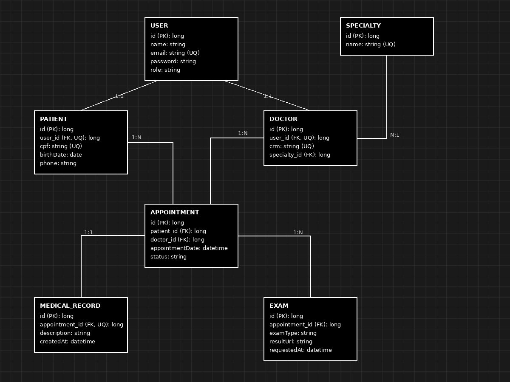

# ClinicHub - Logical Model

## Overview

The logical model defines the database structure of the ClinicHub system, including attributes, primary keys, foreign keys, and relationships between entities.

## Main Decisions

- User stores authentication information.
- Patient and Doctor reference User through a one-to-one relationship.
- Appointment connects patients and doctors.
- MedicalRecord has a one-to-one relationship with Appointment.
- Exam has a one-to-many relationship with Appointment.

## Logical Diagram

